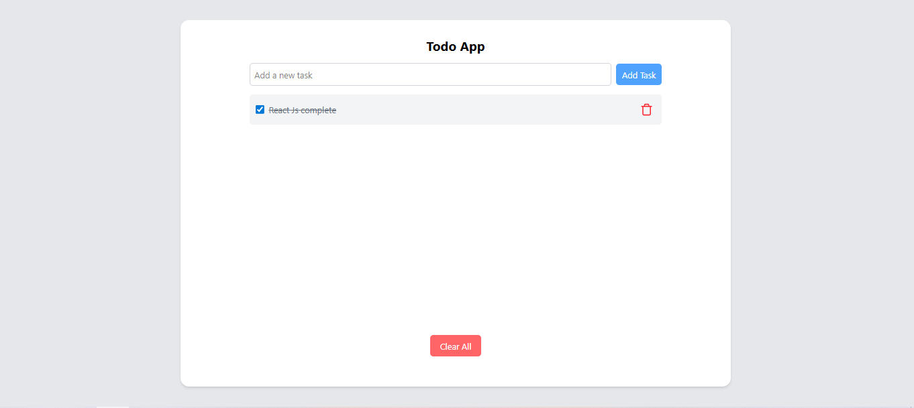

# Todo App

A modern React-based task management application for organizing your daily todos.

## 📸 Preview

<!-- Add screenshot here -->


## Features

- ✅ Create new tasks
- ✏️ Edit existing tasks
- 🗑️ Delete completed tasks
- 📋 View all tasks in one place
- 💾 Local storage persistence

## Installation

```bash
npm install
```

## Usage

```bash
npm start
```

Runs the app in development mode. Open [http://localhost:3000](http://localhost:3000) to view it in your browser.

## Build

```bash
npm run build
```

Builds the app for production to the `build` folder.

## Technologies

- React
- JavaScript
- CSS/HTML

## Getting Started

1. Clone the repository
2. Install dependencies with `npm install`
3. Start the development server with `npm start`
4. Begin adding your todos!

## License

MIT
